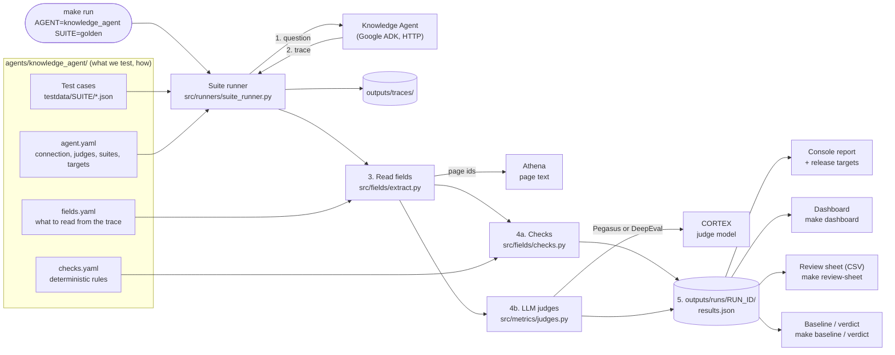
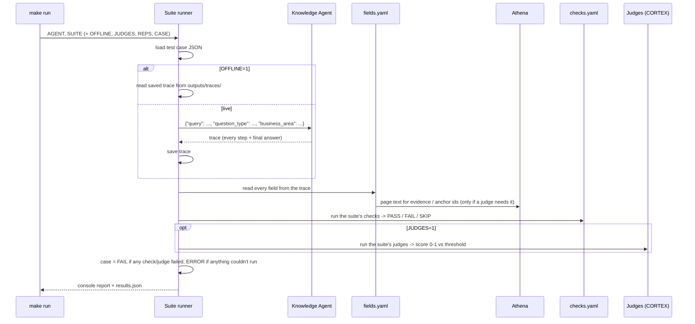
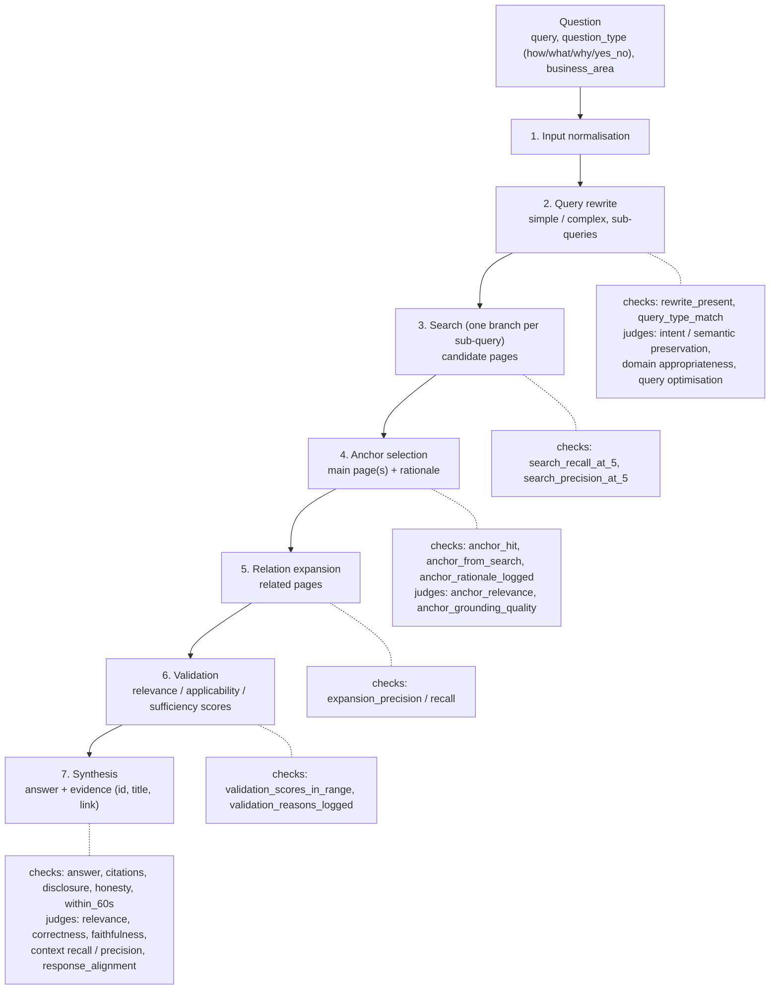

# AI Eval Suite — Getting Started (team handover guide)

**Read this first.** It takes you from an empty laptop to running, reading and reviewing an
evaluation of the Knowledge Agent (KA), one step at a time. Every step says what to type, what you
should see, and what to do when you see something else.

| | |
|---|---|
| **Owner** | Vamsi Manohar (on leave from `<date>` to `<date>`) |
| **Cover while away** | `<name>` |
| **Branch** | `refactor-version-1` |
| **Strategy / background** | `<Confluence link: Knowledge Agent MVP evaluation strategy>` |
| **Reference manual** | [README.md](README.md) — every option, in detail. This guide links to it where needed. |

**How to use this guide:** do Parts 1–5 in order on your first day (about 2 hours, most of it
waiting for installs and access). After that, Part 6 onwards is "how do I…" — jump to what you need.
At the end, [Part 14](#part-14--handover-checklist-prove-you-can-do-it) is a checklist: tick every
row on your own machine and tell your lead which ones did not work.

---

## Contents

1. [What this framework does (in plain words)](#part-1--what-this-framework-does)
2. [Words you will see](#part-2--words-you-will-see)
3. [Architecture (diagrams)](#part-3--architecture)
4. [Set up your machine](#part-4--set-up-your-machine-once)
5. [Your first runs](#part-5--your-first-runs)
6. [Read the results](#part-6--read-the-results)
7. [The suites: what to run, when](#part-7--the-suites-what-to-run-when)
8. [Golden test cases from the CJM sheet](#part-8--golden-test-cases-from-the-cjm-sheet)
9. [SME review sheet and judge calibration](#part-9--sme-review-sheet-and-judge-calibration)
10. [Release check: targets, baseline and verdict](#part-10--release-check-targets-baseline-and-verdict)
11. [Generate test cases (synthesizer)](#part-11--generate-test-cases-synthesizer)
12. [Everyday changes](#part-12--everyday-changes)
13. [Troubleshooting](#part-13--troubleshooting)
14. [Handover checklist](#part-14--handover-checklist-prove-you-can-do-it)
15. [Rules: credentials, data, git](#part-15--rules-credentials-data-git)

---

## Part 1 — What this framework does

The Knowledge Agent answers colleagues' questions from the bank's knowledge base. We need to know,
for every new build of the agent, **are its answers correct, grounded in the right pages, fast
enough, and honest when it doesn't know?**

For each test case (a question, plus what a good answer looks like), the framework:

1. **asks the agent** the question (over HTTP — the agent is a Google ADK app),
2. **saves the trace** — the agent's full record of what it did: how it rewrote the question,
   which pages search found, which page it chose as the main ("anchor") page, which related pages it
   added, its own validation scores, and the final answer with its evidence pages,
3. **reads values out of the trace** — e.g. the answer text, the anchor page ids — as listed in
   `fields.yaml`,
4. **scores them** two ways:
   - **deterministic checks** (`checks.yaml`): rules with a clear yes/no — "the answer has at least
     8 words", "every cited page is in the evidence", "the response came within 60 seconds",
     "the anchor page is the one the golden sheet expects";
   - **LLM judges** (`agent.yaml` → `metrics:`): a judge model on CORTEX scores 0–1 things a rule
     can't — is the answer correct compared with the golden answer? is every claim supported by the
     pages (faithfulness)? Each judge has a threshold (0.7); at or above it = pass,
5. **reports** pass / fail per case and pass **rates** across the run, against release targets
   (e.g. "correctness passes in at least 90% of cases"),
6. **keeps the results** for the dashboard, the SME review sheet, and comparing builds.

Nothing about the KA is hard-coded in the framework (`src/`). Everything KA-specific is in
`agents/knowledge_agent/`. A new agent gets its own folder; `src/` stays the same.

---

## Part 2 — Words you will see

| Word | Meaning |
|---|---|
| **agent** | The AI application under test. Today: `knowledge_agent`. Each has a folder `agents/<agent>/`. |
| **test case** | One JSON file: an `input` (the question) and an optional `expected` block (golden answer, expected anchor page, keywords …). |
| **suite** | A named set of test cases + which judges and checks run on them, e.g. `sanity`, `golden`. Set in `agent.yaml` → `suites:`. Cases live in `agents/<agent>/testdata/<suite>/`. |
| **trace** | The agent's own record of one answer (JSON). Saved to `outputs/traces/<agent>/<suite>/<case>.json`. |
| **field** | A named value read from the trace, e.g. `anchor_page_ids`. Listed in `fields.yaml`. |
| **check** | A deterministic rule on fields → PASS / FAIL / SKIP. Listed in `checks.yaml`. |
| **judge / metric** | An LLM scoring a field 0–1 (e.g. `correctness`). PASS when score ≥ threshold. |
| **Pegasus** | The bank's standard judge library (package `lbg-pegasus`, from SAR). Used when installed; otherwise the same metric runs on **DeepEval**. Each result records which engine scored it. |
| **CORTEX** | The bank's LLM gateway. The judges' model runs there. Reached with an API key or the **CorteX DevKit** (SSO sign-in). |
| **Athena** | The knowledge-base service. The trace only has page *ids*; the framework fetches the page *text* from Athena so judges like faithfulness can read it. |
| **anchor page** | The main page the agent chose to answer from (one, sometimes two). |
| **related / expanded pages** | Pages the agent added around the anchor ("relation expansion"). |
| **evidence** | The pages listed with the final answer (anchor + related), each with id, title and link. |
| **SKIP** | The check/judge didn't apply (e.g. no golden answer in the case, so `correctness` can't run). Not a failure. |
| **ERROR** | Something couldn't run (agent down, CORTEX auth, Athena) — never counted as a pass. |
| **OFFLINE=1** | Don't call the agent: replay the saved traces. Fast, free, no network for the agent. |
| **JUDGES=0** | Don't run LLM judges: checks only. Fast, free, no CORTEX needed. |
| **REPS=5** | Ask every question 5 times — to measure consistency (LLMs are not deterministic). |
| **target** | A pass-rate bar for the whole run (e.g. correctness ≥ 90%). Missed target = not release-ready. |
| **baseline / verdict** | Save a trusted build's results (baseline); compare a new build with it (verdict). |
| **SME** | Subject-matter expert who marks answers good/bad — to check our judges agree with a human. |

---

## Part 3 — Architecture

### 3.1 The big picture



### 3.2 What happens to one test case



### 3.3 The Knowledge Agent's pipeline — and what we check at each stage



**The one principle:** the trace is our only evidence. If the agent doesn't log something, we
can't test it — e.g. "Precision@5" is measured on the search candidates the trace logs, not the
whole search index.

### 3.4 Where things are

```
Makefile                     every command (make help lists them)
GETTING_STARTED.md           this guide
README.md                    reference manual (every option)
metric_library.yaml          the built-in judges: Pegasus class + DeepEval fallback
env/.env.example             every setting, explained  ->  you copy it to env/.env (never committed)
agents/knowledge_agent/
  agent.yaml                 how to reach the agent, judges + thresholds, suites, targets, review columns
  fields.yaml                what to read from the trace (one JMESPath query per field)
  checks.yaml                deterministic checks, in groups
  lookups.py                 fetches page text from Athena by page id
  rubrics/*.md               custom judges in plain English (query rewrite, anchor page)
  testdata/<suite>/*.json    test cases, one file per case
  importers/cjm_golden.yaml  how the CJM golden spreadsheet maps to test cases
  synth/                     test-case generator settings (synthesizer)
src/                         the framework (you rarely need to touch it — src/__init__.py has a map)
tests/                       tests of the framework itself (make test)
outputs/traces/              latest trace per case (the committed ones are offline fixtures)
outputs/runs/<run id>/       results.json of every run            (not committed)
outputs/review/<run id>.csv  SME review sheets                    (not committed)
baselines/<agent>/<suite>.json   saved baselines (committed, so everyone compares with the same one)
```

---

## Part 4 — Set up your machine (once)

### 4.1 Ask for access first (it takes the longest)

Request these on day one; you can install while you wait.

| You need | For | Ask / where |
|---|---|---|
| Access to the git repository | cloning the code | `<repo owner / lead>` |
| **SAR token** (name + pass code) | installing Pegasus and the CorteX DevKit (internal packages) | SAR self-service — the same token the Pegasus guide puts in `pip.conf` |
| **CORTEX access**: either an API key (`CORTEX_HOST`, `CORTEX_CLIENT_ID`, `CORTEX_API_KEY`) or DevKit SSO access | the LLM judges | `<CORTEX onboarding contact>` |
| **Knowledge Agent URL** and app name | calling the agent | `<KA dev team>` |
| **Hive Athena MCP** client id + secret | page text for the judges, and the synthesizer | `<Athena / Hive contact>` |
| The **CJM golden spreadsheet** ("Golden Q&As") | golden test cases | `<SharePoint / Confluence link>` |

Never paste any of these into chat, Confluence, a ticket or a commit. They only go in `env/.env`
on your machine (Part 15).

### 4.2 Install the tools

On a Mac, in Terminal:

```bash
xcode-select --install          # gives you git and make (skip if `git --version` and `make --version` work)
curl -LsSf https://astral.sh/uv/install.sh | sh     # uv: installs Python and every package for you
# (or: brew install uv — or your company's software portal if curl is blocked)
```

Close and reopen Terminal, then check:

```bash
git --version     # any version
make --version    # any version
uv --version      # 0.5 or newer
```

You do **not** need to install Python yourself — uv fetches Python 3.12+ for this project.

### 4.3 Get the code

```bash
cd ~/Documents                                   # or wherever you keep projects
git clone <repo URL> ai-eval-suite
cd ai-eval-suite
git checkout refactor-version-1
git pull
```

Every command in this guide is run **from the `ai-eval-suite` folder**.

### 4.4 Create your settings file

```bash
make setup
```

The first time, this creates `env/.env` from `env/.env.example` and installs everything it can.
Now open `env/.env` in any editor and fill in the values below. Every setting is also explained in
the file itself.

| Setting | What to put | Needed for |
|---|---|---|
| `SAR_TOKEN_NAME`, `SAR_TOKEN_PASS_CODE` | your SAR token | Pegasus + DevKit install |
| `VERIFY_TLS` | keep `false` (the office proxy re-signs HTTPS), **or** set `CA_BUNDLE=<path to corporate CA .pem>` | every HTTPS call |
| `KNOWLEDGE_ADK_BASE_URL` | the KA URL, e.g. `https://…` (no trailing slash) | calling the agent |
| `KNOWLEDGE_ADK_APP_NAME` | the ADK app name (usually `knowledge_agent`) | calling the agent |
| `KNOWLEDGE_ADK_BASE_PATH`, `KNOWLEDGE_ADK_USER_ID` | optional — only if the KA team tells you | calling the agent |
| `HIVE_ATHENA_BASE_URL` | already filled in (test environment) | page text, synthesizer |
| `HIVE_ATHENA_CLIENT_ID`, `HIVE_ATHENA_CLIENT_SECRET` | your Athena MCP credentials | page text, synthesizer |
| `CORTEX_AUTH` | `api_key` or `devkit` (see 4.5) | judges |
| `CORTEX_MODEL` | the judge model name (keep the default unless told otherwise) | judges |
| `CORTEX_HOST`, `CORTEX_CLIENT_ID`, `CORTEX_API_KEY` | only with `CORTEX_AUTH=api_key` | judges |
| `CORTEX_ENV` | only with `devkit`: `int`, `pre` or `prd` | judges |
| `CORTEX_TIMEOUT_S`, `CORTEX_RETRIES` | keep the defaults | judges |

Rules for this file: one `NAME=value` per line, no spaces around `=`, no quotes needed, and put
comments on their **own** line (never after a value).

### 4.5 CORTEX: API key or DevKit

- **`CORTEX_AUTH=api_key`** — fill `CORTEX_HOST`, `CORTEX_CLIENT_ID`, `CORTEX_API_KEY`. Nothing else.
- **`CORTEX_AUTH=devkit`** — no key. After 4.6 (the DevKit must be installed), sign in once:
  ```bash
  make cortex-login        # opens the browser for SSO; the token is kept in your keychain
  ```
  Sign in again when it expires (judges then fail with an auth error — see Part 13).

### 4.6 Install everything (now with your token)

```bash
make setup
```

Read the last lines:

| You see | Meaning |
|---|---|
| `Installed everything, including Pegasus and the CorteX DevKit.` | Perfect. |
| `… Pegasus could not be installed` / `… DevKit could not be installed` | One internal package failed: check the SAR token and that you're on the bank network/VPN, then run `make setup` again. |
| `NOTE: no SAR token in env/.env …` | You haven't filled `SAR_TOKEN_NAME` / `SAR_TOKEN_PASS_CODE`. Everything else is installed; judges run on DeepEval and `CORTEX_AUTH` must be `api_key`. |

Always use `make setup`, never a bare `uv sync` — plain `uv sync` doesn't know your token and
removes Pegasus.

### 4.7 Check the machine: `make doctor`

```bash
make doctor
```

It prints one line per item and makes one real test call to CORTEX (and, when Pegasus is installed,
one Pegasus metric):

| Line | Want | If not |
|---|---|---|
| `virtual env` | `[OK]` | `[WARN]` is fine if it names the project's `.venv` |
| `env files` | `[OK] env/.env` | you're not in the `ai-eval-suite` folder, or `env/.env` is missing → `make setup` |
| `deepeval` | `[OK] <version>` | `make setup` |
| `pegasus` | `[OK] <version>` | `[WARN]` = not installed → SAR token + `make setup` (judges still work, on DeepEval) |
| `certificates` | `[OK]` | `CA_BUNDLE` points at a file that doesn't exist → fix the path or use `VERIFY_TLS=false` |
| `CORTEX_AUTH` | `[OK] api_key` or `devkit` | typo in `env/.env` |
| `CORTEX_HOST` / `CorteX DevKit` | `[OK]` | fill the values for your mode (4.5) |
| `CORTEX call` | `[OK]` | the line shows the URL it called and the error — see Part 13 |
| last line | `All good.` | fix every `[FAIL]` line, run `make doctor` again |

### 4.8 Check the framework itself: `make test`

```bash
make test
```

Runs the framework's own tests — offline, no credentials, about 10 seconds. You want
`… passed` and no `failed`. If anything fails on a fresh checkout, stop and tell your lead: the
problem is the code, not your setup.

---

## Part 5 — Your first runs

Do these in order. Each one adds one moving part, so when something breaks you know which part.

### 5.1 Offline, no judges (no network at all)

```bash
make run AGENT=knowledge_agent SUITE=sanity OFFLINE=1 JUDGES=0
```

This replays the two saved traces in `outputs/traces/knowledge_agent/sanity/` and runs the checks.
You should see:

```
knowledge_agent / sanity
------------------------------------------------------------------------
PASS  TC_002  [11 skipped]
FAIL  TC_012  [10 skipped]
        FAIL  check:fallback_disclosed disclosures empty

Rates over 2 case(s)
  answer_non_empty             check  2/2 = 100%
  ...
  fallback_disclosed           check  0/1 = 0%          (1 skip)
  skipped in every case (no expected data ...): anchor_hit, expansion_precision, ...

Targets (NOT all met)
  MISSED case_pass_rate                 50%  (target >= 100%)  1/2 case runs
  MET    error_rate                      0%  (target <= 5%)  0/2 case runs
------------------------------------------------------------------------
1 passed, 1 failed, 0 errors  ->  outputs/runs/<run id>/results.json
```

**This FAIL is expected and correct.** In TC_012 the agent had no page metadata, fell back to the
top search result, and did not tell the user (no caveat). The `fallback_disclosed` check exists to
catch exactly this. The "skipped" checks need golden data (expected anchor page etc.) that the
sanity cases don't have — skipped is not failed.

How to read a line: `PASS/FAIL  <case id>  [n skipped]`, then one indented line per failure:
`FAIL  check:<name>` or `FAIL  judge:<name>` and the reason.

### 5.2 See what the framework reads from a trace

```bash
make fields AGENT=knowledge_agent CASE=TC_002
```

Prints every field from `fields.yaml` for that saved trace (answer, anchor pages, search candidates,
validation scores, timings …), then every check result. Use this whenever you wonder "what did the
agent actually do?" or when a check fails and you want to see the value it looked at.
`NOT FOUND` = the field's path found nothing in this trace; `empty` = found but empty (e.g. no caveats).

### 5.3 Live agent, no judges

Needs `KNOWLEDGE_ADK_BASE_URL` (and the agent running).

```bash
make run AGENT=knowledge_agent SUITE=sanity JUDGES=0
```

Now each question is sent to the agent (10–60 seconds per question). The new traces overwrite
`outputs/traces/knowledge_agent/sanity/`. Errors here are about the agent connection — see Part 13.

### 5.4 Live agent with judges (the real thing)

Needs CORTEX (4.5) and Athena (page text for faithfulness).

```bash
make run AGENT=knowledge_agent SUITE=sanity
```

Under each case you now also get one line per judge, e.g.

```
        PASS  judge:relevance score=0.86/0.7 [pegasus]
        SKIP  judge:correctness [-] ...          (sanity cases have no golden answer)
        PASS  judge:faithfulness score=0.92/0.7 [pegasus]
```

`score=0.86/0.7` is score / threshold; `[pegasus]` or `[deepeval]` is the engine that scored it.

### 5.5 Open the dashboard

```bash
make dashboard
```

Opens in the browser (http://localhost:8501). Pick the agent, suite and run on the left. Stop it
with `Ctrl+C` in Terminal. What's on each tab: Part 6.

---

## Part 6 — Read the results

Every run gives you the same results in four places.

**1. The console** (Part 5.1): per case PASS / FAIL / ERROR with the reason for every failure, then
the pass rate of every check and judge across the run, then the release targets (MET / MISSED).
The command's exit code is 0 only when everything passed — so it works in CI.

**2. `outputs/runs/<run id>/results.json`** — everything about the run: per case, every check and
judge (status, score, threshold, engine, reason) and every field read from the trace. The run id
looks like `20261008_013336_104_knowledge_agent_sanity` (date_time_agent_suite).

**3. The dashboard** (`make dashboard`, choose agent / suite / run in the left sidebar):

| Tab | What it's for |
|---|---|
| **Overview** | Verdict for the run, release targets, pass rate of every judge and check, a case × result grid. Start here. |
| **Test cases** | One panel per case, problems first: question, the agent's answer, the golden answer and the evidence pages on the left; judges and checks on the right; any error with how to fix it. Inside: *Pipeline fields* (every value read from the trace), *Stage timings*, the test case, and the raw trace. |
| **Consistency** | Only for `REPS>1` runs: per case, a pages × runs grid (anchor / related / cited pages of every repetition, changed rows highlighted) and each run's answer. |
| **Trends** | The last runs of the same suite side by side — is it getting better or worse? |
| **Baseline** | This run compared with the saved baseline (Part 10). |

**4. Rates across many runs** (no agent, no judges):

```bash
make summary AGENT=knowledge_agent SUITE=golden LAST=10   # e.g. anchor hit rate over the last 10 golden runs
```

**When a case FAILS**, find out why in this order:
1. the reason on the console line (e.g. `disclosures empty`);
2. `make fields AGENT=knowledge_agent SUITE=<suite> CASE=<case id>` — the values the check looked at;
3. the dashboard → Test cases → that case → *Pipeline fields* / *raw trace*;
4. decide: **agent bug** (report it to the KA team with the case id and the trace file),
   **test data wrong** (fix the test case), or **check/threshold wrong** (Part 12 — agree it with
   your lead first).

---

## Part 7 — The suites: what to run, when

`make list` shows every suite and its judges. The Knowledge Agent's suites (`agent.yaml` → `suites:`):

| Suite | Cases (in `testdata/`) | Judges | Checks | Use it to… |
|---|---|---|---|---|
| `sanity` | `sanity/` (2) | relevance, correctness, faithfulness | all | smoke-test a new build or your setup; **every case must pass** (target 100%) |
| `golden` | `golden/<domain>/` — imported from the CJM sheet (Part 8) | relevance, correctness, faithfulness, context recall, context precision, response alignment | all | **the release gate**: MVP targets (Part 10) |
| `should_decline` | `should_decline/` (8) — questions the KB can't answer | none | honesty, performance | check the agent warns instead of answering confidently (targets 100%) |
| `question_types` | `question_types/` (4) — how / what / why / yes_no | relevance, response alignment | basic, answer | check the answer has the right shape for its question type |
| `stages` | `sanity/` | the 6 stage judges (query rewrite, anchor page) | basic, pipeline | judge the intermediate steps, not just the answer |
| `synthetic` | `synthetic/<domain>/` — generated (Part 11) | relevance, faithfulness | basic, answer, citations, source page | broad coverage; **not** a release gate |
| `e2e` | `sanity/` | everything above | all | one full pass of every judge on the sanity cases |
| `relevance_only`, `faithfulness_only`, `response_alignment_only` | as named | one judge | none | debug one judge quickly |

Useful flags for any suite:

| Flag | Effect |
|---|---|
| `CASE="KA_GLD_CVH_030 KA_GLD_CVH_031"` | only these cases |
| `OFFLINE=1` | replay saved traces instead of calling the agent |
| `JUDGES=0` | checks only (fast, free, no CORTEX) |
| `REPS=5` | ask every question 5 times (consistency; golden release runs) |
| `BUILD=1.5.0` | label the run with the agent build you tested |

**Cost and time.** A live golden case takes ~30 s for the agent plus ~6 judge calls. 100 cases ×
`REPS=5` ≈ 500 agent calls and 3,000 judge calls — hours, not minutes. Try one or two cases with
`CASE=` first, then run the full suite.

---

## Part 8 — Golden test cases from the CJM sheet

The golden cases come from the CJM spreadsheet ("Golden Q&As"): one row per question with the
golden answer, the expected anchor page and the expected related pages. The spreadsheet is the
**source of truth** — fix mistakes there, then re-import.

### 8.1 Import

Download the sheet as `.xlsx`, then:

```bash
make import-cases AGENT=knowledge_agent FILE="~/Downloads/KA golden.xlsx" SHEET="Golden Q&As" DRY_RUN=1   # preview
make import-cases AGENT=knowledge_agent FILE="~/Downloads/KA golden.xlsx" SHEET="Golden Q&As"             # write
```

Put the file name in quotes (it has spaces). `SHEET=` is the tab name — leave it out if the tab is
called `Sheet1`. The preview prints how many cases are new / updated / unchanged, and which rows
lack a golden answer or an anchor page (those cases will SKIP the matching judges and checks).

What the importer does (settings: `agents/knowledge_agent/importers/cjm_golden.yaml`):

- one JSON file per row: `testdata/golden/<domain>/KA_GLD_<DOMAIN>_<Test ID>.json`, e.g.
  `KA_GLD_CVH_030` = Test ID 30 in workstream CVH;
- the cell `Anchor: 26942  Relational: 8412; 7053` becomes `expected_anchor_page_ids: ["26942"]` and
  `expected_related_page_ids: ["8412", "7053"]`; page titles lose their `(id)` suffix;
- the sheet's Question Type is sent to the agent only when it's one the agent accepts
  (how / what / why / yes_no); anything else is left out (the agent then answers in its general shape)
  and kept in `metadata.question_type_in_sheet`;
- empty cells (`NA`, `N/A`, `-` count as empty) are left out — never guessed;
- it **stops** if a column header isn't found (it prints the headers it did find — usually a renamed
  column or the wrong `SHEET=`) or if two rows share a Test ID.

Re-importing overwrites the files it made. Files no row produced are listed, never deleted.

### 8.2 Run

```bash
make run AGENT=knowledge_agent SUITE=golden CASE="KA_GLD_CVH_030"     # one case first
make run AGENT=knowledge_agent SUITE=golden                           # all
make run AGENT=knowledge_agent SUITE=golden REPS=5 BUILD=<build>      # the release run (consistency too)
```

---

## Part 9 — SME review sheet and judge calibration

Our judges are LLMs. Before we trust "correctness passed in 92% of cases", an SME checks a sample:
do they agree with the judge?

### 9.1 Make the sheet

```bash
make review-sheet AGENT=knowledge_agent SUITE=golden                 # the latest golden run
make review-sheet AGENT=knowledge_agent SUITE=golden RUN=<run id>    # a specific run
```

It writes `outputs/review/<run id>.csv` (opens in Excel). One row per case (per repetition), columns:

| Column | Content |
|---|---|
| `run_id`, `case_id`, `rep` | which run, case and repetition |
| `question`, `agent_answer`, `expected_answer` | the question, what the agent said, the golden answer |
| **Pages search found** | every page id the search returned for the agent to choose from |
| **Anchor pages** | the anchor page(s) the agent chose — `id \| title \| link`, one per line |
| **Related pages** | the related pages it added — `id \| title \| link` |
| **Pages cited in the answer** | the pages the answer itself cites — `id \| title \| link` |
| `<judge>_score`, `<judge>_verdict`, `<judge>_threshold` | for every judge in the run |
| `sme_verdict`, `sme_notes` | **empty — for the SME** |

The four page columns are set in `agent.yaml` → `review_columns:` (heading: field). They come from
fields saved with the run, so **make the sheet from a run made with the current code** — older runs
leave them empty.

### 9.2 The SME marks it

Send the CSV to the SME. For ~20 or more rows they fill:

- `sme_verdict`: `pass` or `fail` — "is this answer good enough to give a colleague?"
- `sme_notes`: why, in a few words (optional, but gold for the KA team).

They must **keep it as CSV** (Excel: File → Save As → CSV UTF-8) and not change the other columns.

### 9.3 Compare the judges with the SME

```bash
make calibrate FILE=outputs/review/<run id>.csv
```

For every judge: how many rows were compared (`n`), how often it **agrees** with the SME, its
**false passes** (judge said pass, SME said fail — the dangerous kind: we'd ship a bad answer), its
**false fails**, and the threshold that would have agreed best.

How to act on it: with fewer than ~20 marked rows, don't change anything. If a judge has false passes
and a clearly better threshold, propose the new threshold to your lead with the calibration output,
then change it in `agent.yaml` → `metrics:` (Part 12). Rows without an `sme_verdict` are ignored.

---

## Part 10 — Release check: targets, baseline and verdict

### 10.1 Targets (is this build good enough?)

A **threshold** decides pass/fail for one case; a **target** decides whether the whole run is good
enough. The golden suite's targets (`agent.yaml` → `suites: golden: targets:`), from the MVP success
metrics:

| Target | Meaning |
|---|---|
| `correctness: 0.90` | ≥ 90% of case runs pass the correctness judge |
| `faithfulness: 0.95` | ≥ 95% pass faithfulness (claims supported by the pages) |
| `context_precision: 0.90`, `context_recall: 0.90` | the pages retrieved are relevant / contain the golden answer |
| `anchor_hit: 0.80` | ≥ 80% chose the expected anchor page |
| `within_60s: 0.95` | ≥ 95% answered within 60 seconds |
| `error_rate: 0.05` | ≤ 5% of case runs could not be evaluated (a ceiling) |
| `consistency: 1.0` | with `REPS>1`: every case chose the same anchor page(s) and passed correctness in every repetition |

The console ends with `Targets (all met)` or `Targets (NOT all met)` and a MET / MISSED line per
target. A target with no result at all (e.g. skipped everywhere) counts as MISSED.

### 10.2 Baseline and verdict (is the new build worse than the last good one?)

```bash
make baseline AGENT=knowledge_agent SUITE=golden BUILD=1.4.0 REPS=5   # once, on a build everyone trusts
git add baselines/ && git commit -m "baseline knowledge_agent golden @ 1.4.0"

make verdict  AGENT=knowledge_agent SUITE=golden BUILD=1.5.0 REPS=5   # every new build
```

The verdict **fails** when, for any case × check/judge, the pass rate drops by 15 points or more,
or the mean judge score drops by 0.10 or more, or something in the baseline didn't run, or the run
had errors — and also when a release target is missed. A baseline is refused if its run had errors.
Reuse a run instead of running again: `uv run --frozen python -m src verdict knowledge_agent golden --from-run latest`.

---

## Part 11 — Generate test cases (synthesizer)

For broad coverage beyond the golden sheet, the synthesizer writes new questions + reference answers
from knowledge-base pages (Athena) with the CORTEX model. Needs Athena and CORTEX.

```bash
make sources AGENT=knowledge_agent GROUP="CVH"                      # fetch that domain's pages (synth/page_ids.json)
make goldens AGENT=knowledge_agent GROUP="CVH"                      # generate cases for them
make goldens AGENT=knowledge_agent IDS="36626" STYLES="type_how type_why"   # one page, two question styles
make run     AGENT=knowledge_agent SUITE=synthetic                  # evaluate the agent on them
```

- Cases go to `testdata/synthetic/<domain>/KA_SYN_<DOMAIN>_<n>.json`, each with
  `metadata.approval_status: UNREVIEWED`. **A human must read them before they count for anything.**
- Styles (`synth/styles/*.md`): six generic ones plus `type_how`, `type_what`, `type_why`,
  `type_yes_no`, which also send `question_type` to the agent.
- New cases are added next to the old ones; `REPLACE=1` replaces the earlier cases of the styles you
  generate. Details: README → *Synthesizer*.

---

## Part 12 — Everyday changes

Agree any change to a threshold, target or check with your lead first — they change what "pass" means.
After any change: `make test`, then a quick `make run … OFFLINE=1 JUDGES=0` to see it still works.

### Add a test case by hand

Create `agents/knowledge_agent/testdata/<suite>/<CASE_ID>.json`:

```json
{
  "test_case_id": "TC_013",
  "description": "What the case is about, in one line",
  "input": {"question": "How do I add a support need?", "question_type": "how"},
  "expected": {
    "expected_answer": "The golden answer, in full sentences.",
    "expected_anchor_page_ids": ["40345"],
    "expected_related_page_ids": ["40017", "40015"],
    "keywords": ["support need"]
  }
}
```

Everything in `expected` is optional — a judge or check that needs a missing value SKIPs.
`question_type` (how / what / why / yes_no) and `business_area` are optional inputs.

### Change a threshold or target

`agents/knowledge_agent/agent.yaml`: thresholds under `metrics:` (e.g. `correctness: {threshold: 0.7}`),
targets under `suites: <suite>: targets:`.

### Add or change a deterministic check

`agents/knowledge_agent/checks.yaml`. Copy a similar check in the right group, e.g.

```yaml
  answer:
    answer_min_words: {type: min_words, field: answer, min: 8}
```

Types (all explained at the top of `src/fields/checks.py`): `present`, `one_of`, `equals`,
`min_words`, `not_contains`, `range`, `same_count`, `subset`, `any_in`, `all_in`, `precision`, `recall`;
plus `when:` to run a check only sometimes. Check it with `make fields AGENT=knowledge_agent CASE=TC_002`.

### The agent's trace format changed (fields come back empty, or cases ERROR with "has the trace format changed?")

1. Run a case live so you have a new trace, then `make fields AGENT=knowledge_agent CASE=<case id>`.
2. Note every field that says `NOT FOUND` (or an unexpected `empty`).
3. Fix its path in `agents/knowledge_agent/fields.yaml`. Each field is a JMESPath query on one
   document made from the trace:

   | Starts with | Is |
   |---|---|
   | `final.` | the final output the caller receives (answer, confidence, caveats, evidence) |
   | `state.` | the agent's session state (query, rewritten_query, search_branches, evidence_set, validation scores) |
   | `nodes.<node name>` | the outputs of one workflow node, e.g. `nodes._anchor_branch_worker[*].rationale` |
   | `models.<agent name>` | the replies of one model agent |
   | `messages` | every text in the trace (status lines) |
   | `timing`, `trace` | seconds per step; the trace file itself (e.g. `trace.latency_ms`) |

   Examples: `state.evidence_set.anchor_page_ids`, `"final.evidence[].title"` (quote paths with `[`,
   `*`, `|` or `?`). A list of paths `[new.path, old.path]` means "the first that finds something" —
   handy while old and new traces both exist.
4. Run `make fields …` again until nothing important is `NOT FOUND`, then `make test`.

To learn JMESPath, use https://jmespath.org with **made-up** JSON only — never paste a real trace
into a website. Test real traces locally with `make fields`.

### Add an LLM judge with your own criteria

Write the criteria in plain English in `agents/knowledge_agent/rubrics/<name>.md` (copy an existing
one), then add one line under `metrics:` in `agent.yaml`:

```yaml
  my_judge: {rubric: rubrics/my_judge.md, threshold: 0.7}           # judges question + answer
  my_stage_judge: {rubric: rubrics/x.md, answer: rewritten_query}  # judge another field instead of the answer
```

and add `my_judge` to a suite's `metrics: [...]`. A built-in judge (Pegasus/DeepEval) is just its
name from `metric_library.yaml`.

### Add a suite

Add it under `suites:` in `agent.yaml` (copy one), and put its cases in `testdata/<suite name>/`
(or point at another folder with `testdata: testdata/sanity`).

### Add a new agent

`make new-agent NAME=claims_agent INPUT_FIELD=question` — creates `agents/claims_agent/` from the
template and prints the next steps. Details: README → *Add an agent*.

---

## Part 13 — Troubleshooting

Run `make doctor` first — it catches most setup problems and prints the URL it called.

| You see | Cause | Fix |
|---|---|---|
| `make: *** No rule to make target` | not in the `ai-eval-suite` folder | `cd` into it |
| `uv: command not found` | uv not on your PATH yet | reopen Terminal; or reinstall uv (4.2) |
| `No module named 'jmespath'` (or another module) | packages not installed / lock file older than the code | `git pull`, then `make setup`. Still there: `uv lock` then `make setup` |
| `[WARN] pegasus not installed` | no SAR token, or SAR unreachable | fill `SAR_TOKEN_*` in `env/.env`, be on the bank network/VPN, `make setup` |
| `SSL: CERTIFICATE_VERIFY_FAILED` | the office proxy re-signs HTTPS | `VERIFY_TLS=false` in `env/.env`, or `CA_BUNDLE=<corporate CA file>` |
| CORTEX `401` / `403` | wrong or expired key; DevKit sign-in expired | check `CORTEX_API_KEY` / `CORTEX_CLIENT_ID`; with devkit: `make cortex-login` |
| CORTEX `404` | wrong URL | the error names the URL it called — compare with `CORTEX_HOST` (must end in `/v1`) |
| CORTEX `429` | rate limited | it retries; run fewer cases (`CASE=`) or lower `REPS` |
| Case ERROR: connection refused / timed out (agent) | agent down, wrong URL, or not on VPN | check `KNOWLEDGE_ADK_BASE_URL`, VPN, ask the KA team if the environment is up |
| Case ERROR: `required field(s) ['answer'] not found in the trace — has the trace format changed?` | the agent's trace changed | Part 12 → *trace format changed* |
| Case ERROR: `get_page_content_from_athena(<id>) failed` | Athena credentials/URL, or the page doesn't exist | check `HIVE_ATHENA_*` in `env/.env`; try `make sources AGENT=knowledge_agent IDS="<id>"` |
| `judge:correctness` always SKIP | the cases have no `expected_answer` | expected for sanity; for golden, fill the sheet and re-import |
| Load error: `field '…' uses the old {from: x, path: y} form` | an old-style line in `fields.yaml` | write it as one path, e.g. `{from: state, path: query}` → `state.query` |
| Load error: `… are neither checks nor groups` / `unknown keys` | typo in `agent.yaml` / `checks.yaml` | the message names the file and the key |
| `make import-cases`: header not found | wrong tab, or a column was renamed | `SHEET="<tab name>"`; or update `columns:` in `importers/cjm_golden.yaml` |
| Review sheet page columns empty | the run was made before those fields existed | re-run the suite, then `make review-sheet` |
| Dashboard: "No runs yet" | no run for that agent/suite yet | `make run …` first |
| git: `.git/index.lock` or `HEAD.lock` exists | an earlier git command was interrupted | make sure no git command is running, then delete that file |

Still stuck? Note the exact command, the full error, and `make doctor` output, then ask `<cover>`.

---

## Part 14 — Handover checklist (prove you can do it)

Do each row on **your own machine**, without help. Tick it, or write what went wrong and which part
of this guide was unclear — then send the list to your lead.

| # | Task | Command / how | You should see | ✔ / problem |
|---|---|---|---|---|
| 1 | Install tools | Part 4.2 | `git`, `make`, `uv` print versions | |
| 2 | Clone, switch branch | Part 4.3 | `git branch --show-current` → `refactor-version-1` | |
| 3 | Settings filled | Part 4.4–4.5 | `env/.env` has your values (and `git status` does **not** list it) | |
| 4 | Install everything | `make setup` | "Installed everything, including Pegasus and the CorteX DevKit." | |
| 5 | Machine check | `make doctor` | `All good.` | |
| 6 | Framework tests | `make test` | `… passed`, nothing failed | |
| 7 | Offline run | `make run AGENT=knowledge_agent SUITE=sanity OFFLINE=1 JUDGES=0` | TC_002 PASS, TC_012 FAIL on `fallback_disclosed` | |
| 8 | Explain row 7 | — | in your words: why TC_012 fails, and why that is correct | |
| 9 | Look inside a trace | `make fields AGENT=knowledge_agent CASE=TC_012` | anchor pages 40022 and 40015, `disclosures` empty | |
| 10 | Live run, checks only | `make run AGENT=knowledge_agent SUITE=sanity JUDGES=0` | both cases evaluated, no ERROR | |
| 11 | Live run with judges | `make run AGENT=knowledge_agent SUITE=sanity` | judge lines with `score=…/0.7 [pegasus]` | |
| 12 | Dashboard | `make dashboard` | your run on Overview; open a case on Test cases | |
| 13 | Import goldens | Part 8.1 with `DRY_RUN=1`, then without | files in `testdata/golden/<domain>/` | |
| 14 | One golden case | `make run AGENT=knowledge_agent SUITE=golden CASE="<one id>"` | correctness and anchor_hit not skipped | |
| 15 | Consistency | same as 14 with `REPS=3` | dashboard shows a Consistency tab | |
| 16 | Review sheet | `make review-sheet AGENT=knowledge_agent SUITE=golden` | CSV with page columns filled | |
| 17 | Calibrate | mark 5 rows `pass`/`fail` yourself, `make calibrate FILE=…` | agreement and false passes per judge | |
| 18 | Change something | add a test case (Part 12), run it with `CASE=` | your case in the console | |
| 19 | Fix a field | in a copy of `fields.yaml`, break one path, run `make fields`, see `NOT FOUND`, put it back | you can explain what happened | |
| 20 | Release targets | read the `Targets` block of a golden run | you can say which targets were MET / MISSED and why | |

---

## Part 15 — Rules: credentials, data, git

**Credentials**
- Secrets (CORTEX key / client secret, SAR token, Athena secret) live only in `env/.env` on your
  machine. Never in code, YAML, test cases, commits, chat, tickets or screenshots.
- `env/` is git-ignored (only `env/.env.example` is committed). Before every commit, `git status`
  must not show anything under `env/`.
- `make doctor` never prints secrets — share its output freely.

**Data**
- Traces and answers contain internal knowledge-base content. Keep them on bank machines; don't
  paste them into external websites or tools.
- Complaints-agent traces contain customer PII: never use them as fixtures or commit them.
- `outputs/` is not committed, except `outputs/traces/` fixtures — commit a new trace there only on
  purpose (it becomes an offline test fixture).
- Golden and synthetic test cases: follow your lead's rule on where they may be stored before
  committing them.

**Git**
- Work on `refactor-version-1` (or a branch off it for bigger changes, then a pull request).
- `git pull` before you start; `make test` before you push.
- Commit `baselines/` when you save a baseline, so the whole team compares with the same one.
- Small, focused commits with a message that says what and why.

---

*Questions this guide didn't answer are bugs in the guide — add the answer here (or tell your lead)
so the next person doesn't hit the same wall.*
