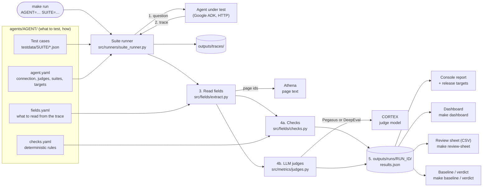
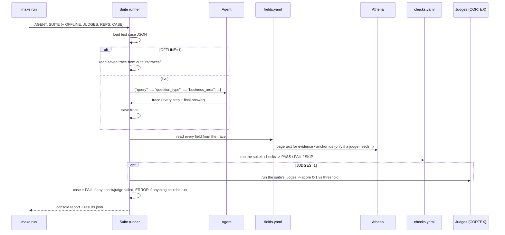
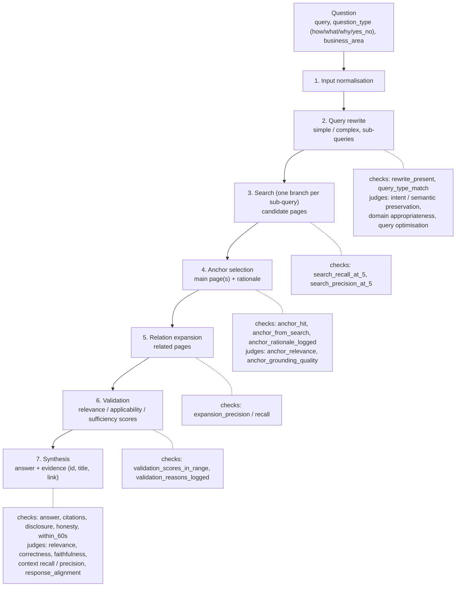

# AI Eval Suite

An agent-agnostic framework for evaluating AI agents: it asks the agent every test question, saves
the agent's trace, reads what it needs from the trace, scores it with deterministic checks and LLM
judges, and reports pass / fail against release targets. Today it evaluates the **Knowledge Agent**
(answers colleagues' questions from the knowledge base); a new agent is a new folder under `agents/`.

**First time here? Set up with [SETUP.md](SETUP.md)** — step by step, from a fresh clone to your
first run. This README explains how the framework works and how to use it.

## Contents

- [How it works](#how-it-works) · [Architecture](#architecture) · [Words used here](#words-used-here)
- [Project layout](#project-layout) · [Everyday commands](#everyday-commands) · [Suites](#suites)
- [Read the results](#read-the-results) · [Where do I change…?](#where-do-i-change)
- [A test case](#a-test-case) · [Metrics](#metrics) · [CORTEX and Pegasus](#cortex-and-pegasus)
- [Trace fields and checks](#trace-fields-and-checks) · [Add an agent](#add-an-agent)
- [Import test cases from a spreadsheet](#import-test-cases-from-a-spreadsheet) · [Synthesizer](#synthesizer-generate-test-cases)
- [SME review sheet and judge calibration](#sme-review-sheet-and-judge-calibration)
- [Release targets and consistency](#release-targets-and-consistency) · [Baseline and verdict](#baseline-and-verdict)
- [Pass, fail, skip, error](#pass-fail-skip-error) · [Troubleshooting](#troubleshooting)

## How it works

For every test case of a suite, `make run AGENT=<agent> SUITE=<suite>`:

1. **calls the agent** with the case's input (HTTP; Google ADK by default),
2. **saves the trace** — the agent's record of every step and the final answer,
3. **reads the input and expected values** from the test case (`testdata/<suite>/*.json`),
4. **reads fields out of the trace** — one JMESPath query per field in `fields.yaml`; page text the
   trace only names by id is looked up (Athena for the Knowledge Agent),
5. **scores** them:
   - **deterministic checks** (`checks.yaml`) — rules with a clear yes / no, e.g. "every cited page is
     in the evidence", "answered within 60 s", "chose the expected anchor page";
   - **LLM judges** (`agent.yaml` → `metrics:`) — a judge model on CORTEX scores 0–1 what a rule
     can't, e.g. correctness against the golden answer, faithfulness to the pages; pass at or above
     the threshold. Pegasus runs them when installed, DeepEval otherwise,
6. **reports** pass / fail per case, pass rates across the run, and the suite's **release targets**,
7. **keeps the results** (`outputs/runs/<run id>/results.json`) for the dashboard, the SME review
   sheet, and comparing a new build with a saved **baseline** (verdict).

Everything agent-specific lives in `agents/<agent>/` (YAML, plus small optional Python). `src/` is
the same for every agent — you should never need to edit it to onboard an agent or change metrics.

## Architecture

### Components



### One test case, end to end



### The Knowledge Agent's pipeline, and what is checked at each stage



**The trace is the only evidence.** What the agent doesn't log can't be tested — e.g. "Precision@5"
is measured on the search candidates the trace logs, not on the whole search index.

## Words used here

| Word | Meaning |
|---|---|
| **agent** | the AI application under test; one folder `agents/<agent>/` each |
| **test case** | one JSON file: `input` (the question) and an optional `expected` block (golden answer, expected pages, keywords …) |
| **suite** | a named set of test cases + the judges and checks run on them (`agent.yaml` → `suites:`); cases in `testdata/<suite>/` |
| **trace** | the agent's own record of one answer; saved to `outputs/traces/<agent>/<suite>/<case>.json` |
| **field** | a value read from the trace, e.g. `anchor_page_ids` (`fields.yaml`) |
| **check** | a deterministic rule on fields → PASS / FAIL / SKIP (`checks.yaml`) |
| **judge / metric** | an LLM scoring a field 0–1; PASS at or above its threshold |
| **anchor page** | the main page the Knowledge Agent answers from (one, sometimes two) |
| **related / expanded pages** | pages the agent adds around the anchor |
| **evidence** | the pages returned with the answer (anchor + related): id, title, link |
| **target** | a pass-rate bar for the whole run, e.g. correctness ≥ 90% |
| **baseline / verdict** | a trusted build's saved results / a new build compared with them |
| **OFFLINE=1** | replay saved traces instead of calling the agent |
| **JUDGES=0** | checks only, no LLM judges |
| **REPS=n** | ask every question n times (consistency) |
| **SME** | subject-matter expert who marks answers, to check the judges agree with a human |

## Project layout

```
Makefile                        every command (make help)
scripts/setup.sh                what `make setup` does (uv sync + Pegasus + CorteX DevKit)
metric_library.yaml             built-in metrics: Pegasus class, DeepEval fallback, fields they need
env/
  .env.example                  every setting, documented — `make setup` copies it to env/.env
  .env                          your values: CORTEX, Athena, agent URLs            (not committed)
  .env.<agent>                  optional, one agent's values; override env/.env    (not committed)
agents/
  <agent>/                      everything about one agent lives in its folder
    agent.yaml                  connection, metrics (+ thresholds), suites
    checks.yaml                 deterministic checks, in groups (optional)
    testdata/<suite>/*.json     test cases, one per file
    rubrics/*.md                custom judge criteria, in plain English     (optional)
    fields.yaml                 what to read from the trace, one line per field (optional)
    lookups.py                  values looked up outside the trace by id, e.g. page text   (optional)
    parser.py                   Python for what fields.yaml / checks: can't express  (optional, rare)
    client.py                   only for agents that are not Google ADK     (optional)
    synth/                      test-case generator: synth.yaml, styles/, instructions.md (optional)
  _template/                    what `make new-agent` copies
src/                            the framework — src/__init__.py has a map of it
  cli.py                        every make command lands here (python -m src ...)
  core/                         paths, env files, HTTPS certificates (tls), agent.yaml loading, results, errors
  clients/                      adk_client (the agent), cortex_client (judge model: API key or DevKit), athena_client
  runners/                      suite_runner (steps 1-6 for every case), test_cases (loading test data)
  fields/                       extract (fields.yaml), checks (checks.yaml), lookup (lookups.py), preview (make fields)
  importers/                    spreadsheet -> test cases (make import-cases)
  metrics/                      library (which metrics exist), judges (engine rule + DeepEval + Pegasus)
  verdict/                      baseline (save), compare (verdict + tolerances)
  reporting/                    console report, dashboard.py (Streamlit)
  synthesizer/                  generator, settings, documents, output_template,
                                sources/ (athena_mcp, files, json_records)
  onboarding/                   new_agent (make new-agent), doctor (make doctor)
  utils/                        adk_trace (helpers for parser.py), text, html_text
tests/                          test_runner, test_metrics, test_verdict, test_synthesizer, test_clients
baselines/<agent>/<suite>.json  committed, so the team compares against the same baseline
outputs/traces/                 latest trace per case (committed ones are offline fixtures)
outputs/runs/<run id>/          results.json + that run's traces (not committed)
```

Every file starts with a comment saying what it does, who uses it and what you'd change there.
Reading order for the code: `src/runners/suite_runner.py` → `src/metrics/judges.py` →
`src/verdict/compare.py` → `src/clients/`.

**In a parser**, import the helpers from the framework:

```python
from src.core.results import check                                    # a deterministic check
from src.utils.adk_trace import state, find_event, event_json, tool_calls  # read the ADK trace
```

## Everyday commands

| I want to…                                  | Command |
|---------------------------------------------|---------|
| check this machine is ready                 | `make doctor` |
| sign in to CORTEX with the DevKit (once)    | `make cortex-login` |
| see agents, suites and their metrics        | `make list` |
| create a new agent                          | `make new-agent NAME=claims_agent INPUT_FIELD=claim_id` |
| run a suite                                 | `make run AGENT=knowledge_agent SUITE=sanity` |
| run only some cases                         | `... CASE="TC_001 TC_002"` |
| rerun without calling the agent             | `... OFFLINE=1` |
| skip the LLM judges (fast, free)            | `... JUDGES=0` |
| run every case several times                | `... REPS=5` |
| save a stable build as the baseline         | `make baseline AGENT=.. SUITE=.. BUILD=1.4.0 REPS=5` |
| check a new build against the baseline      | `make verdict  AGENT=.. SUITE=.. BUILD=1.5.0 REPS=5` |
| import test cases from Excel / CSV          | `make import-cases AGENT=knowledge_agent FILE="~/Downloads/golden.xlsx" [DRY_RUN=1]` |
| fetch source documents for the synthesizer  | `make sources AGENT=knowledge_agent [GROUP="…"] [IDS="36626"]` |
| generate test cases from them               | `make goldens AGENT=knowledge_agent [GROUP=…] [IDS=…]` |
| pass rate of every check / judge (e.g. anchor hit rate) over the last N runs | `make summary AGENT=knowledge_agent SUITE=golden LAST=10` |
| look at results                             | `make dashboard` |
| SME review sheet for a run (judge calibration) | `make review-sheet AGENT=knowledge_agent SUITE=golden [RUN=<run id>]` |
| judge vs SME agreement, best threshold      | `make calibrate FILE=outputs/review/<run id>.csv` |
| test the framework itself                   | `make test` |

Every command exits with 1 when something failed, so it drops straight into CI.

## Suites

`make list` shows every agent, suite and its judges. The Knowledge Agent's suites (`agent.yaml` → `suites:`):

| Suite | Cases (`testdata/…`) | Judges | Checks | Use it to… |
|---|---|---|---|---|
| `sanity` | `sanity/` | relevance, correctness, faithfulness | all | smoke-test a build or a setup; every case must pass |
| `golden` | `golden/<domain>/` — imported from the CJM sheet | relevance, correctness, faithfulness, context recall, context precision, response alignment | all | **the release gate** (MVP targets) |
| `should_decline` | `should_decline/` — questions the KB can't answer | – | honesty, performance | check the agent warns instead of answering confidently |
| `question_types` | `question_types/` — how / what / why / yes_no | relevance, response alignment | basic, answer | check the answer's shape fits its question type |
| `stages` | `sanity/` | the 6 stage judges (query rewrite, anchor page) | basic, pipeline | judge intermediate steps, not just the answer |
| `synthetic` | `synthetic/<domain>/` — generated | relevance, faithfulness | basic, answer, citations, source page | broad coverage; not a release gate |
| `e2e` | `sanity/` | all of the above | all | every judge once on the sanity cases |
| `relevance_only`, `faithfulness_only`, `response_alignment_only` | as named | one judge | none | debug one judge |

Flags for any `make run` / `baseline` / `verdict`: `CASE="ID1 ID2"` (only these cases),
`OFFLINE=1`, `JUDGES=0`, `REPS=5`, `BUILD=1.5.0` (label the run with the agent build).

**Time and cost:** a live case takes ~10–60 s for the agent plus one call per judge. 100 golden
cases × `REPS=5` is 500 agent calls and ~3,000 judge calls — hours. Try one case with `CASE=` first.

## Read the results

Every run's results appear in four places:

1. **Console** — per case `PASS` / `FAIL` / `ERROR`, one indented line per failure
   (`FAIL  check:<name> <reason>`; judges as `PASS  judge:relevance score=0.86/0.7 [pegasus]` =
   score / threshold [engine]), then the pass rate of every check and judge, then the release
   targets (MET / MISSED). The exit code is 0 only when everything passed, so it works in CI.
2. **`outputs/runs/<run id>/results.json`** — everything: per case every check and judge (status,
   score, threshold, engine, reason) and every field read from the trace. Run ids look like
   `20261008_013336_104_knowledge_agent_sanity`.
3. **Dashboard** — `make dashboard` (http://localhost:8501; choose agent, suite and run on the left):

   | Tab | Shows |
   |---|---|
   | Overview | verdict, release targets, pass rate of every judge and check, a case × result grid |
   | Test cases | per case (problems first): question, answer, golden answer, evidence pages; judges and checks; errors with how to fix them; inside: pipeline fields, stage timings, the test case, the raw trace |
   | Consistency | `REPS>1` runs only: anchor / related / cited pages of every repetition side by side, and each run's answer |
   | Trends | recent runs of the same suite |
   | Baseline | this run against the saved baseline (a `make verdict` run opens its own release view — see [Baseline and verdict](#baseline-and-verdict)) |
4. **Rates over many runs** — `make summary AGENT=knowledge_agent SUITE=golden LAST=10`.

**When a case fails:** read the reason on the console line → `make fields AGENT=<agent> SUITE=<suite>
CASE=<id>` to see the values the check looked at → the dashboard's Test cases tab (pipeline fields,
raw trace). Then decide: agent bug (report it with the case id and trace file), wrong test data
(fix the case), or wrong check / threshold (change it — agree that with the team first).

## Where do I change…?

| I want to…                                        | Change this |
|---------------------------------------------------|-------------|
| add a new agent                                   | `make new-agent NAME=my_agent INPUT_FIELD=question` |
| point an agent at a different URL / app / headers | `env/.env`, or `connection:` in `agents/<agent>/agent.yaml` |
| add or edit test cases                            | `agents/<agent>/testdata/<suite>/*.json` |
| add a suite (regression, goldens, …)              | `suites:` in `agents/<agent>/agent.yaml` + a `testdata/<suite>/` folder |
| choose which metrics a suite runs                 | `suites:` → `metrics: [...]` in `agents/<agent>/agent.yaml` |
| change a threshold                                | `metrics:` in `agents/<agent>/agent.yaml` |
| add / remove a **Pegasus** (or DeepEval) metric   | `metric_library.yaml` — then use it by name in any agent |
| the judges' LLM temperature (all judges)          | `judge_temperature:` at the top of `metric_library.yaml` (default 0.0) |
| add a custom judge for one agent                  | a rubric in `agents/<agent>/rubrics/` + one line under `metrics:` |
| read a value from the trace (a stage output, …)   | one line in `agents/<agent>/fields.yaml`; preview with `make fields` — see [Trace fields and checks](#trace-fields-and-checks) |
| judge a stage output (rewritten query, tool, …)   | a field in `fields.yaml`, then point the metric at it (`answer: rewritten_query`) |
| add a deterministic check for one agent           | `agents/<agent>/checks.yaml` (YAML), or `checks()` in `parser.py` for real logic |
| send more than the question to the agent (e.g. question_type) | `message: {format: json, fields: {...}}` in `agent.yaml` |
| use a Pegasus metric outside RAG (e.g. agentic)   | an entry with `module:` + `columns:` in `metric_library.yaml` (see `response_alignment`) |
| choose which checks a suite runs                  | `checks: all \| none \| [groups or names]` under the suite in `agent.yaml` |
| the agent's trace format changed                  | `make fields AGENT=.. CASE=..` shows which fields came back empty; fix their paths in `fields.yaml` |
| evaluate an agent that isn't Google ADK           | `agents/<agent>/client.py` (copy `client.py.example`) |
| turn a spreadsheet of test cases into JSON        | `agents/<agent>/importers/<name>.yaml` — see [Import test cases from a spreadsheet](#import-test-cases-from-a-spreadsheet) |
| generate test cases from documents (synthesizer)  | `agents/<agent>/synth/` — see [Synthesizer](#synthesizer-generate-test-cases) |
| judge model / CORTEX / Pegasus / Athena settings  | `env/.env` |
| regression tolerance for verdicts                 | `PASS_RATE_DROP`, `SCORE_DROP` at the top of `src/verdict/compare.py` |
| CORTEX with an API key, or with the DevKit        | `CORTEX_AUTH=api_key` or `devkit` in `env/.env` (see [CORTEX and Pegasus](#cortex-and-pegasus)) |
| CORTEX timeout / retries / API key                | `CORTEX_TIMEOUT_S`, `CORTEX_RETRIES`, `CORTEX_API_KEY` in `env/.env` |
| SSL certificate errors (office proxy)             | `VERIFY_TLS=false` or `CA_BUNDLE=...` in `env/.env` (one setting for every call) |
| Pegasus "not installed" warning                    | SAR token in `env/.env`, then `make setup` ([SETUP.md](SETUP.md), Step 5); check with `make doctor` |
| an endpoint, header or auth scheme changed        | the matching file in `src/clients/` |
| add a new kind of synthesizer source (an API, …)  | one new file in `src/synthesizer/sources/` (copy `json_records.py`) |

You should never need to edit `src/` to onboard an agent or change metrics.

## A test case

```json
{
  "test_case_id": "TC_012",
  "description": "Third party reports a support need when the customer is not present",
  "input":    { "question": "A third party has called up and ..." },
  "expected": {
    "keywords": ["CARERS"],
    "expected_answer": "Always balance data privacy with ...",
    "expected_anchor_page_id": "8194"
  }
}
```

- `input.<input_field>` (from agent.yaml) is sent to the agent. Use `message_template:` in agent.yaml
  if the agent needs the input wrapped in a sentence.
- Everything in `expected` is optional. `keywords` are checked for every agent; anything else is
  used by that agent's `checks:` (or `parser.py`) or by judges.
- A judge that needs something the case doesn't have (e.g. `correctness` without `expected_answer`)
  is **skipped** for that case and shown as skipped.
- One file can also hold many cases: `{"cases": [ {...}, {...} ]}`.

## Metrics

**Built-in metrics** live in `metric_library.yaml`. Each entry says which Pegasus class and/or
DeepEval class implements it and which fields it needs:

```yaml
faithfulness:
  needs: [question, answer, contexts]
  pegasus: Faithfulness              # used when Pegasus is installed
  deepeval: FaithfulnessMetric       # used otherwise
```

To add a Pegasus metric, add an entry with its class name from `pegasus.metrics.rag`.
To remove one, delete the entry. Available today: relevance, faithfulness, correctness,
context_precision, context_recall (Pegasus + DeepEval), contextual_relevancy, summarization (DeepEval).

**An agent uses metrics by name** in its `agent.yaml`, with its own thresholds, and adds its own
rubric-based judges:

```yaml
metrics:
  relevance:   {threshold: 0.7}                    # from metric_library.yaml
  correctness: {threshold: 0.8}
  intent_preservation:                             # custom judge (DeepEval GEval)
    rubric: rubrics/intent_preservation.md
    answer: rewritten_query                        # judge the rewritten query, not the final answer

suites:
  sanity:     {metrics: [relevance]}                            # quick: one metric
  e2e:        {testdata: testdata/sanity, metrics: [relevance, correctness, intent_preservation]}
  regression: {metrics: [relevance, correctness]}               # data in testdata/regression/
```

**Judge temperature.** Every judge (Pegasus and DeepEval) runs at `judge_temperature` from the top of
`metric_library.yaml` — `0.0`, so the same answer gets the same score from run to run (as far as the
model allows). It is saved with each run, and `make verdict` notes when the baseline used another value.
A Pegasus metric whose `evaluate()` doesn't accept a temperature runs at the model's default, with a warning.

**Which engine runs a metric — one rule:** a custom rubric runs on DeepEval GEval; a library metric
runs on **Pegasus if it has a `pegasus:` class and Pegasus is installed**, otherwise on DeepEval.
`engine: deepeval` on a metric forces DeepEval (rarely needed). `method: ragas` passes a Pegasus method.

**What a judge sees.** Judges read four standard fields:

| field             | default value |
|-------------------|---------------|
| `question`        | the case input sent to the agent |
| `answer`          | the agent's final answer |
| `contexts`        | the trace's `context` (retrieved documents), if any |
| `expected_answer` | the case's `expected.expected_answer` |

`fields.yaml` can override them and add more (e.g. `rewritten_query`, `anchor_titles`), and a metric
can read a standard field from any of them (`answer: rewritten_query`). Custom rubrics
judge `question` + `answer` unless you list more: `needs: [question, answer, contexts]`.

## CORTEX and Pegasus

How to set them up: [SETUP.md](SETUP.md), Steps 4–7. How they work:

### CORTEX: API key or DevKit

All judges and the synthesizer talk to CORTEX. Choose how in `env/.env`:

| `CORTEX_AUTH=` | What you set up | Notes |
|---|---|---|
| `api_key` (default) | `CORTEX_HOST`, `CORTEX_CLIENT_ID`, `CORTEX_API_KEY` | calls the gateway directly |
| `devkit` | the SAR token (below), `make setup`, then `make cortex-login` once | CorteX DevKit: SSO in the browser, no API key; the DevKit finds the CorteX host itself (`CORTEX_ENV=int\|pre\|prd` pins one) |

Pegasus signs its own CORTEX calls. With `devkit` it uses Pegasus' own DevKit support — the same
`get_model(adapter="cortex_v2", auth_mode="devkit", cortex_env=...)` call as the Knowledge Agent's
guardrails — so no key is needed (`CORTEX_ENV`, default `prd`). With `api_key` it uses `CORTEX_API_KEY`
(or client id + secret).
`make doctor` checks whichever mode you chose and makes one test call.

### Pegasus

Pegasus (`lbg-pegasus`) and the CorteX DevKit (`cortex-devkit`) come from SAR, so they need your SAR
token — the same token the Pegasus guide puts in `pip.conf`. The project is already set up for both
(`pyproject.toml`: their SAR indexes and the `pegasus` / `devkit` groups, the guides' "uv option").
Installing them needs only your SAR token in `env/.env` and `make setup` ([SETUP.md](SETUP.md), Step 5);
the steps are in `scripts/setup.sh`. The token is handed to uv for that one command and stored nowhere else.

Without Pegasus, Pegasus metrics run on DeepEval, and every result records which engine scored it.
Use `make setup`, not a bare `uv sync`: plain `uv sync` doesn't know your token and removes Pegasus.
When a `make setup` with the token changes `uv.lock`, commit that change once.

## Trace fields and checks

Everything evaluation reads from a trace is listed in `agents/<agent>/fields.yaml` — one line per
field, no Python. The trace is first turned into one JSON document with these parts:
`final` (the final output), `state` (session state, latest value wins), `nodes` ({node name: its
outputs}), `models` ({agent name: its model replies}), `messages` (every text), `timing` and `trace`
(the file itself). Each field is then a [JMESPath](https://jmespath.org) query on that document:

```yaml
fields:
  answer:            {path: final.answer.summary, required: true}
  rewritten_query:   {path: state.rewritten_query, join: "\n"}
  branch_anchor_ids: "state.search_branches.*.anchor_page_id"            # every branch
  anchor_titles:     {path: final.evidence, where: {page_id: anchor_page_ids}, pick: title}
  anchor_rationales: "nodes._anchor_branch_worker[*].rationale"
  validation_status: "messages[?contains(@, 'Validation complete')] | [-1]"
```

- A plain string is the path. Learn the syntax on jmespath.org with made-up JSON (never paste a
  real trace into a website); `make fields` shows what each field gives on a real trace.
- A list of paths means "the first that finds something", handy while a trace format is changing.
- More options (`where`, `pick`, `unique`, `join`, `default`, `required`) are explained at the top of
  `src/fields/extract.py`.
- `lookup:` gets values **outside the trace, by id**, with a function the agent provides in
  `agents/<agent>/lookups.py`. The Knowledge Agent's `get_page_content_from_athena` fetches each
  evidence page from Athena and cleans the HTML, which is how Faithfulness gets its evidence while
  the trace carries only page ids:
  `contexts: {lookup: get_page_content_from_athena, ids: evidence_page_ids}`.
  Another agent writes its own function (e.g. calling its API and returning the JSON); the framework
  knows nothing about Athena or HTML. Each id is looked up once per run and saved under
  `outputs/lookups/<agent>/<function>/`; `OFFLINE=1` reuses saved copies (and looks up ids it never
  saved). A failed lookup makes the case an ERROR (never a low score).

**Preview** what every field gives for saved traces, and what the checks make of it — no agent call,
no judges:

```bash
make fields AGENT=knowledge_agent CASE=TC_002      # NOT FOUND = the path found nothing
```

When the agent's trace format changes, run this, fix the paths that come back `NOT FOUND`, run it
again. A field marked `required: true` that finds nothing makes the case an ERROR ("has the trace
format changed?") instead of silently skipping judges.

**Checks** are YAML too, in `agents/<agent>/checks.yaml` (next to `agent.yaml`, like `fields.yaml`), on any field:

```yaml
checks:
  confidence_valid:   {type: one_of, field: confidence, values: [HIGH, MEDIUM, LOW]}
  fallback_disclosed: {type: present, field: disclosures, when: {field: metadata_missing, is: true}}
  anchor_hit:
    type: any_in
    compare:                                    # the first pair the case has an expected value for
      - {field: anchor_page_ids, expected: expected_anchor_page_ids}
      - {field: anchor_titles,   expected: expected_anchor_page_titles}
```

Types: `present`, `one_of`, `equals`, `min_words`, `not_contains`, `range`, `same_count`, `subset`,
`any_in`, `all_in`, `precision`, `recall` (see `src/fields/checks.py`). A check whose expected value
the case lacks is SKIPPED. `parser.py` is still there for logic YAML can't express.

Options:

```yaml
  search_recall_at_5:                    # Recall@k / Precision@k on the list the agent logged, in its order
    type: recall
    k: 5
    compare: [{field: search_candidates, expected: expected_anchor_page_ids}]
  search_precision_at_5:
    type: precision
    k: 5
    compare: [{field: search_candidates, expected: [expected_anchor_page_ids, expected_related_page_ids]}]  # union
  warns_when_it_cannot_answer:           # only for cases whose expected block says should_decline: true
    {type: present, field: disclosures, when: {expected: should_decline, is: true}}
  validation_reasons_logged:             # every listed field must be non-empty
    {type: present, fields: [anchor_rationale, validation_reasons]}
```

Retrieval checks only see what the agent's trace logs (e.g. `search_branches.*.filtered_page_ids`):
"Precision@5" means precision of the top 5 candidates *as logged*, not of the full search index.

Checks can be written in groups (`answer:`, `citations:`, `retrieval:` …; the dashboard shows them by
group), and **each suite chooses which checks it runs** — judges and checks are set separately:

```yaml
suites:
  golden:          {metrics: [relevance, correctness, faithfulness]}            # checks: all (default)
  relevance_only:  {metrics: [relevance], checks: none}                          # judges only
  stages:          {metrics: [intent_preservation], checks: [basic, pipeline]}   # groups and/or check names
```

`basic` is the built-in group (`answer_non_empty`, `expected.keywords`). Lookups
(`lookup:` fields) run only when one of the suite's judges or checks reads the field, so a
relevance-only suite never calls Athena.

**Dashboard** (`make dashboard`): Overview (pass rates, every judge and check across the run, a
case × result grid), Test cases (one accordion per case: question, answer, reference answer and
evidence pages on the left; LLM judges and deterministic checks, kept apart, on the right; any error
explained with how to fix it), Trends (recent runs of the same suite) and Baseline.

## Add an agent

```bash
make new-agent NAME=claims_agent INPUT_FIELD=claim_id
```

This creates `agents/claims_agent/` from the template and prints the next steps: put its URL in
`env/.env`, choose metrics and suites in `agent.yaml`, add test cases, `make run AGENT=claims_agent SUITE=sanity`.
Add `fields.yaml` entries when you want stage fields, and `checks.yaml` for
agent-specific checks — `agents/knowledge_agent/` is a full example. For an agent that is not Google
ADK, rename `client.py.example` to `client.py` and fill in the three TODOs.

## Import test cases from a spreadsheet

Golden cases often live in Excel. One command turns every row into a test case JSON file:

```bash
make import-cases AGENT=knowledge_agent FILE="~/Downloads/KA golden.xlsx" DRY_RUN=1   # preview
make import-cases AGENT=knowledge_agent FILE="~/Downloads/KA golden.xlsx"             # write
make run          AGENT=knowledge_agent SUITE=golden
```

The importer (`src/importers/`) is the same for every agent and reads `.xlsx` or `.csv` (no extra
package needed). What the columns mean and what the case JSON looks like is set per agent in
`agents/<agent>/importers/<name>.yaml` — copy `agents/knowledge_agent/importers/cjm_golden.yaml`
for a new agent or a new sheet layout, and change `columns:` and `output:`. Pick one with
`MAPPING=<name>` when an agent has several, and another sheet with `SHEET="Sheet 2"`.

- **The sheet is the source of truth.** Re-importing overwrites the files it produced; the summary
  says how many are new, updated or unchanged. JSON files no row produced are listed, never deleted.
- **Empty cells are left out** of the JSON (`NA`, `N/A`, `-` count as empty), so a case without an
  expected answer or anchor page SKIPs that judge or check. The summary lists which cases lack them.
- **Messy cells are cleaned in the mapping, not in the sheet:** `labelled:` splits a cell like
  `Anchor: 26942  Relational: 8412; 7053` into anchor and related ids, `lists:` splits multi-value
  cells (`items` = new lines or `;`), and `strip:` removes e.g. the `(3012)` after a page title.
- **Stops before writing** when a column header isn't found (it prints the headers it did find) or
  two rows give the same test case id.

Knowledge Agent naming (CJM goldens): id `KA_GLD_<DOMAIN>_<Test ID, 3 digits>`, e.g. `KA_GLD_CVH_030`,
in `testdata/golden/<domain>/`. The domain comes from the Workstream column (`domain.codes` in the
mapping). Synthesized cases go to `testdata/synthetic/` (suite `synthetic`), so the two never mix.

## Synthesizer (generate test cases)

Generate many realistic test cases for any agent from source documents, with DeepEval's Synthesizer
(the generator model is the CORTEX model from `env/.env`). Three independent parts, all configured in the
agent's `synth/synth.yaml`:

```
SOURCE                        GENERATOR                          OUTPUT TEMPLATE
where documents come from  ─► styles × evolutions × quality  ─►  the JSON shape of this
(Athena, files, JSON, API)    filter; checks + de-duplication    agent's test cases
```

```
agents/knowledge_agent/synth/
  synth.yaml         source + styles + evolutions + quality filter + output template
  page_ids.json      page ids grouped by domain (used by the athena_mcp source)
  instructions.md    rules every generated question and answer must follow
  styles/*.md        one per question style: ## scenario / ## task / ## additional_guidance /
                     ## input_format / ## expected_output_format
  cache/             fetched documents (make sources); runs/  one manifest per generation run
```

```bash
make sources AGENT=knowledge_agent                                  # fetch every page in page_ids.json
make goldens AGENT=knowledge_agent GROUP="Recoveries Commercial Bank"  # generate for one domain
make goldens AGENT=knowledge_agent IDS="36626"                      # …or for specific pages
make goldens AGENT=knowledge_agent IDS="36626" STYLES="type_how type_why"   # …only some styles
make run     AGENT=knowledge_agent SUITE=synthetic                  # evaluate the agent on them
```

**Sources.** Every source turns what it reads into the same document —
`{"id", "title", "text", "group", "metadata"}` — so the generator never knows where it came from.

| `source: {type: …}` | For | Settings |
|---|---|---|
| `athena_mcp` | knowledge-base pages from the Hive Athena MCP server | `ids_file`; `HIVE_ATHENA_*` in `env/.env` |
| `files` | a folder of `.txt` / `.md` / `.json` files; sub-folders become groups | `folder` (default `documents`) |
| `json_records` | one JSON file with a list of records (an API export, a table) | `file`, `records_key`, `id_field`, `group_field`, `title_field`, `text_fields` |
| your own | any other system | `src/synthesizer/sources/<name>.py` with `fetch(settings, ids, folder) -> [documents]` |

`ids_file` (any id-based source) groups ids: `[{"domain": "…", "page_ids": ["…"]}]` (`group`/`ids` also work).
`GROUP=` picks groups, `IDS=` picks ids. `make goldens` fetches whatever isn't in `cache/` yet;
`make sources` re-fetches on purpose.

**Generator.** One DeepEval Synthesizer run per document × style, so every case knows its exact source.
A document that fails doesn't stop the run. Cases with an empty or placeholder question/answer, and
duplicate questions, are dropped. Each run writes a manifest to `synth/runs/` (generated / skipped / failed).
Config mistakes stop the run before anything is generated: an unknown `## section` in a style,
evolution weights that don't add up to 1, a missing file.

**Output template.** `output:` in synth.yaml is the exact shape of one test case, with placeholders:
`{generated.input}` `{generated.expected_output}` `{source.id}` `{source.title}` `{source.metadata.<key>}`
`{style}` `{question_type}` `{group}` `{group_slug}` `{domain}` `{domain_folder}` `{run.id}` `{run.generated_at}` `{run.model}` `{agent.input_field}` `{id}` `{n:03}`.
Leave `output:` out to get the standard evaluation case (`input.<input_field>`, `expected.expected_answer`,
`metadata.approval_status: UNREVIEWED`). If a style asks for JSON in its `input_format`, the template can
read its fields: `{generated.input.request}` (cases where the JSON is missing that field are skipped).

- Knowledge Agent cases are written **domain-wise**, like the golden importer:
  `testdata/synthetic/<domain>/KA_SYN_<DOMAIN>_<n>.json` (the style is in `metadata.style`). The domain is
  the group in `page_ids.json`, so name groups like the sheet's Workstreams (`CVH` -> `KA_SYN_CVH_001`).
- **Question types.** The generic styles (direct, procedural, conditional, eligibility, simple, complex)
  send plain questions. The typed styles `type_how`, `type_what`, `type_why`, `type_yes_no` set
  `question_type:` in synth.yaml: it is sent to the agent, and the reference answer is written in the
  shape the agent gives for that type (steps, definitions, reasons, yes/no + explanation).
- New cases are **added** next to existing ones (numbering continues). `REPLACE=1` replaces the earlier
  cases of the styles being generated (other styles in the same folder stay) — only after generation succeeded.
- Generated cases start as `approval_status: UNREVIEWED`. They all run by default; a suite can keep only
  reviewed ones with `only: {metadata.approval_status: APPROVED}`.
- **Add a style:** a new `styles/<name>.md` + one line under `styles:`.
- **Another agent:** copy `agents/knowledge_agent/synth/`, change `source:` and `output:`.

## SME review sheet and judge calibration

The judges are LLMs. Before trusting "correctness passed in 92% of cases", an SME marks a sample of
answers and we measure how often the judges agree.

**1. Make the sheet** (from a run made with the current code):

```bash
make review-sheet AGENT=knowledge_agent SUITE=golden                # latest run
make review-sheet AGENT=knowledge_agent SUITE=golden RUN=<run id>   # a given run
```

It writes `outputs/review/<run id>.csv` (opens in Excel), one row per case and repetition:

| Column | Content |
|---|---|
| `run_id`, `case_id`, `rep` | which run, case, repetition |
| `question`, `agent_answer`, `expected_answer` | the question, the agent's answer, the golden answer |
| *the agent's `review_columns:`* | Knowledge Agent: **Pages search found** (ids), **Anchor pages**, **Related pages**, **Pages cited in the answer** — each page as `id \| title \| link`, one per line |
| `<judge>_score`, `<judge>_verdict`, `<judge>_threshold` | for every judge in the run |
| `sme_verdict`, `sme_notes` | empty — for the SME |

The extra columns are set per agent in `agent.yaml`: `review_columns: {column heading: field}`.

**2. The SME marks it:** for ~20+ rows, `sme_verdict` = `pass` / `fail` ("good enough to give a
colleague?") and optional `sme_notes`. Keep the file as CSV (Excel: Save As → CSV UTF-8) and don't
change other columns.

**3. Compare:**

```bash
make calibrate FILE=outputs/review/<run id>.csv
```

Per judge: rows compared, **agreement** with the SME, **false passes** (judge passed what the SME
failed — the dangerous kind), false fails, and the threshold that would agree best. Change a
threshold in `agent.yaml` only with enough rows (20+) and a clear gain. Rows without an
`sme_verdict` are ignored.

## Release targets and consistency

Thresholds decide pass / fail **per case** (correctness ≥ 0.7). Targets decide whether the **run** is
good enough to release — pass rates across all cases, per suite in `agent.yaml`:

```yaml
suites:
  golden:
    metrics: [correctness, faithfulness, ...]
    targets:
      correctness: 0.90        # ≥ 90% of case runs pass the correctness judge
      within_60s: 0.95         # a check name works too
      error_rate: 0.05         # ceiling: ≤ 5% of case runs could not be evaluated
      case_pass_rate: 0.90     # ≥ 90% of case runs pass everything
      consistency: 1.0         # with REPS > 1: every case consistent (below)
```

A target with no verdict in the run (skipped everywhere) counts as **missed**. Targets show on the
console, on the dashboard Overview, and `make verdict` fails if one is missed.

**Consistency** (REPS > 1) is set once per agent:

```yaml
consistency:
  same: anchor_page_ids        # the main pages must be the same in every repetition (order ignored)
  min_overlap: 1.0             # 1.0 = identical sets; the lowest pair counts
  all_pass: [correctness]      # and these must pass in every repetition (default: every judge)
  report: [cited_page_ids, expanded_page_ids]   # overlap shown, not gated
```

A case is consistent only if both hold; an inconsistent case is a failure. The answer's wording may
differ between runs — its meaning is what `all_pass` checks. Run with `REPS=5`. The dashboard then has
a **Consistency** tab: per case a pages × runs grid (anchor / expanded / cited per run, changed rows
highlighted) and the answer, confidence and scores of every run.

## Baseline and verdict

```bash
make baseline AGENT=knowledge_agent SUITE=e2e BUILD=1.4.0 REPS=5    # on a build you trust
git add baselines/ && git commit -m "baseline knowledge_agent e2e @ 1.4.0"

make verdict  AGENT=knowledge_agent SUITE=e2e BUILD=1.5.0 REPS=5    # on the new build
```

LLM agents and judges aren't deterministic, so run each case several times (`REPS`). For every
case × check/judge the baseline stores the pass rate and mean score (`baselines/<agent>/<suite>.json`),
and the whole baseline run — every case's answer, pages, scores and reasons — in
`baselines/<agent>/<suite>.run.json`. Commit both. The verdict **fails** when:

- a pass rate drops by 15 points or more (e.g. 100% → 80%), or
- a mean judge score drops by 0.10 or more — even if it is still above the threshold, or
- something in the baseline didn't run at all, or the run had agent/judge errors.

It also flags when a score came from a different engine, or a different `judge_temperature`, than the
baseline (not comparable).

**See it in the dashboard.** `make verdict` saves the verdict with its run, so `make dashboard` lists it
in the Run picker as **⚖ VERDICT PASS/FAIL · 1.5.0 vs 1.4.0** (the run saved by `make baseline` shows as
**★ BASELINE**). Picking a verdict opens the release view: a PASS / FAIL banner with the reason, the
headline numbers against the baseline, and four tabs —

| Tab | Shows |
|---|---|
| Summary | how the test cases moved (regressed / improved / unchanged), release targets for both builds, every LLM judge (mean score) and every check that moved (pass rate), baseline → this build, and what changed per case |
| Comparison | one row per test case — baseline status, this build's status, what changed — filterable by change, by judge / check and by text; open a case to see both builds side by side: scores, failed checks, answers, pages |
| This build | every case of the new build, in full (the usual test case view; sidebar filters apply) |
| Baseline build | every case of the baseline build, in full |

Each verdict keeps a copy of the baseline it was judged against, so an old verdict still shows the same
comparison after a new baseline is saved.
To reuse a run instead of running again: `uv run python -m src verdict AGENT SUITE --from-run latest`.
A baseline is refused if its run had errors.

## Pass, fail, skip, error

| Status | Meaning | Effect on the case |
|---|---|---|
| pass  | check/judge passed | – |
| fail  | check failed, or judge score below threshold | case fails |
| skip  | the case doesn't have the data this judge needs | none |
| error | the agent or the judge couldn't run (network, auth, crash) | case errors |

An unreachable agent or judge is an **error** — never a pass, a skip, or a score of 0.

## Troubleshooting

Setup problems (installs, certificates, CORTEX auth, `make doctor`): [SETUP.md → Problems](SETUP.md#problems-during-setup).

| You see | Cause | Fix |
|---|---|---|
| case `ERROR`: `required field(s) ['answer'] not found in the trace — has the trace format changed?` | the agent's trace format changed | `make fields AGENT=.. CASE=..` on a new trace; fix the `NOT FOUND` paths in `fields.yaml` ([Trace fields and checks](#trace-fields-and-checks)) |
| load error: `field '…' uses the old {from: x, path: y} form` | an old-style line in `fields.yaml` | write one path: `{from: state, path: query}` → `state.query` |
| load error: `unknown keys`, `are neither checks nor groups`, `not fields in fields.yaml` | a typo in `agent.yaml` / `checks.yaml` / `fields.yaml` | the message names the file and the key |
| `judge:correctness` always SKIP | the cases have no `expected.expected_answer` | expected for sanity; for golden, fill the sheet and re-import |
| a check always SKIP | the case lacks the expected value it compares with, or its `when:` never held | listed as "skipped in every case" on the console |
| `make import-cases`: header not found | wrong tab, or a renamed column | `SHEET="<tab>"`, or update `columns:` in `agents/<agent>/importers/<mapping>.yaml` |
| `make import-cases`: duplicate test case id | two rows share a Test ID | fix the sheet |
| review sheet page columns empty | the run was made before those fields existed | re-run the suite, then `make review-sheet` |
| `make verdict` fails with no regression shown | a release target was missed, or the baseline had something this run didn't | read the Targets block and the "not run" lines |
| dashboard: "No runs yet" | no run for that agent / suite | `make run …` first |

## Coming from the earlier `evalkit/` layout of this branch

Same behaviour, new places. `make` commands are unchanged; `python -m evalkit` is now `python -m src`.

| was | now |
|---|---|
| `evalkit/runner.py` | `src/runners/suite_runner.py` + `src/runners/test_cases.py` |
| `evalkit/judges.py` | `src/metrics/judges.py` + `src/metrics/library.py` |
| `evalkit/verdict.py` | `src/verdict/baseline.py` + `src/verdict/compare.py` (+ printing in `src/reporting/console.py`) |
| `evalkit/adk.py` | `src/clients/adk_client.py` + trace helpers in `src/utils/adk_trace.py` |
| `evalkit/cortex.py` | `src/clients/cortex_client.py` |
| `evalkit/config.py` | `src/core/agent_config.py`, `src/core/env.py`, `src/core/paths.py` |
| `evalkit/results.py` | `src/core/results.py` (+ `src/reporting/console.py`) |
| `evalkit/synth.py` | `src/synthesizer/` (generator, settings, documents, output_template) |
| `evalkit/sources/`, `sources/athena_mcp.py` | `src/synthesizer/sources/` (+ `src/clients/athena_client.py`) |
| `evalkit/new_agent.py` | `src/onboarding/new_agent.py` |
| `dashboard.py` | `src/reporting/dashboard.py` |
| `.env`, `.env.example` | `env/.env`, `env/.env.example` (a root `.env` is still read if `env/.env` is missing) |
| in parser.py: `from evalkit import adk, check` | `from src.core.results import check` and `from src.utils.adk_trace import state, ...` |

## Coming from the v1 framework (`main` before this branch)

| v1 | now |
|---|---|
| `configs/agents.yaml` | `connection:` + `input_field:` in `agents/<agent>/agent.yaml` |
| `configs/metrics/<agent>/catalog.yaml` | `metrics:` in `agents/<agent>/agent.yaml` |
| `configs/evaluations/<agent>/<suite>.yaml` | `suites:` in `agents/<agent>/agent.yaml` |
| `configs/criteria/<agent>/*.md` | `agents/<agent>/rubrics/*.md` |
| `configs/cortex.yaml` (timeout, retries, verify, auth header) | `CORTEX_TIMEOUT_S`, `CORTEX_RETRIES`, `CORTEX_API_KEY`, `VERIFY_TLS` in `env/.env` |
| `testdata/<agent>/<suite>/` | `agents/<agent>/testdata/<suite>/` |
| `make new-agent name=x` | `make new-agent NAME=x` |
| `make test-ka-sanity-judges` | `make run AGENT=knowledge_agent SUITE=sanity` |
| `EVAL_MODE=cache` / `RUN_JUDGES=false` | `OFFLINE=1` / `JUDGES=0` |
| `METRICS_SUITE`, `METRIC_MODE`, `sanity_pegasus` suites | not needed — the engine is chosen per metric |
| `make verdict-baseline` / `verdict-check` | `make baseline` / `make verdict` |
| `configs/synthesizers/knowledge_agent/*` (config, evolution, filtration yaml) | one `agents/knowledge_agent/synth/synth.yaml` + `instructions.md` + `styles/` |
| `data/knowledge_agent/source_docs/`, `configs/synthesizers/knowledge_agent/page_ids.json` | `agents/knowledge_agent/synth/cache/`, `…/synth/page_ids.json` |
| `src/clients/hive_athena_mcp_client.py` + `src/synthesizer/clean.py` | `src/clients/athena_client.py` + `src/synthesizer/sources/athena_mcp.py` |
| `make synth-ka-prepare` / `synth-ka-generate` | `make sources AGENT=knowledge_agent` / `make goldens AGENT=knowledge_agent` |
| `make synth-ka-generate-page PAGE_ID=…` / `-domain DOMAIN=…` | `make goldens AGENT=knowledge_agent IDS=…` / `GROUP=…` |
| synthesized cases' `reference.answer` | `expected.expected_answer` (set in the output template) |
| `testdata/knowledge_agent/golden/` | `agents/knowledge_agent/testdata/golden/` (suite `golden`, key `expected_answer`) |
| `HIVE_ATHENA_CLIENT_ID` / `HIVE_ATHENA_CLIENT_SECRET` (Athena MCP) | same names, in `env/.env`; the server URL is now `HIVE_ATHENA_BASE_URL` |

Rename these in your `env/.env` if you still have the old names:
`KNOWLEDGE_BASE_URL_LOCAL` → `KNOWLEDGE_ADK_BASE_URL`, `KNOWLEDGE_BASE_PATH_LOCAL` → `KNOWLEDGE_ADK_BASE_PATH`,
`KNOWLEDGE_APP_NAME_LOCAL` → `KNOWLEDGE_ADK_APP_NAME`, `KNOWLEDGE_USER_ID_LOCAL` → `KNOWLEDGE_ADK_USER_ID`.
Settings are read from `env/.env` (shared) and `env/.env.<agent>` (one agent, overrides the shared file); a root `.env` is still read when `env/.env` doesn't exist. `env/.env.factfind.api` is no longer read — copy the CORTEX values you need into `env/.env`.
Traces saved by v1 in `outputs/traces/` still replay with `OFFLINE=1`.

Not carried over (still in git history on `main`): the Fact Find Workflow agent (being decommissioned —
its agent folder, parser, rubrics, ground-truth payloads and payload generator), the A/B comparison and
Excel export branches. To bring an agent like it back later: `make new-agent`, then copy its rubrics and
parser logic from `main`.
